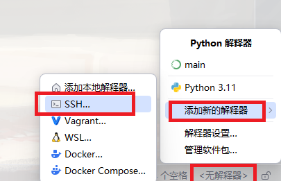
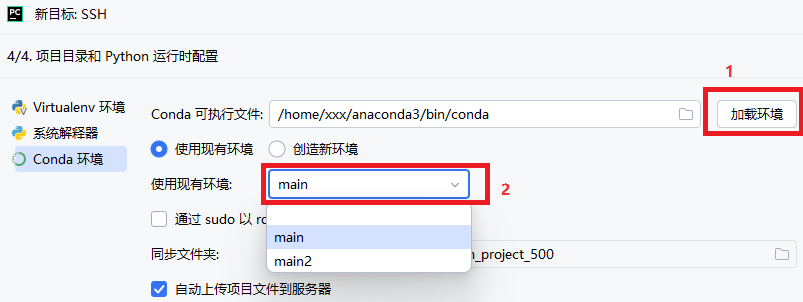
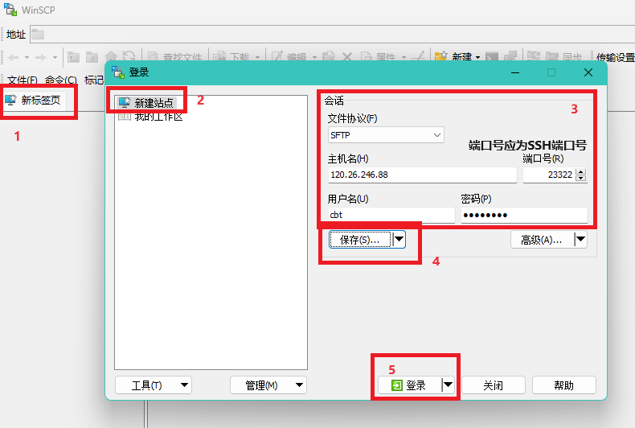
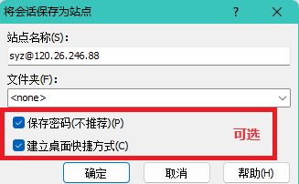
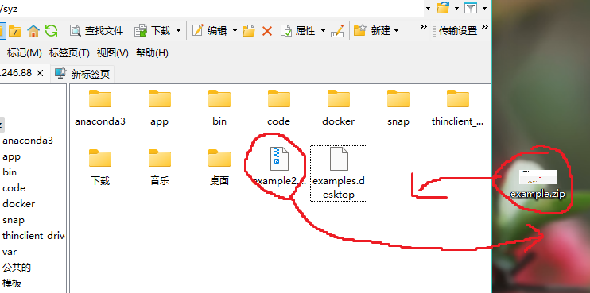

本手册将介绍如何访问服务器的方法。这些方法应当适用于大多数类型的深度学习服务器

# 服务器信息
在手册之外，您应该还得到服务器的下面几项信息:

|名称|介绍|例子|
|---|---|---|
|**IP地址**|服务器公网IP地址|`114.51.41.91`|
|**SSH端口**|服务器公网端口,用来连接SSH终端|`23322`|
|**RDP端口**|服务器公网端口,用来连接远程桌面|`23389`|
|**用户名**|Linux服务器的账户名|`exampleuser`|
|**密码**|Linux服务器的密码|`password$pasu`|

另外您可能需要一些非必要的信息:
1. 公网IP地址更换时间
2. ED25519指纹

# 连接
## SSH  
连接命令: ssh -p **SSH端口** **用户名**@**IP地址**
> 例如: ssh -p 23322 exampleuser@114.51.41.91

## 远程桌面

可使用Windows自带的远程桌面客户端连接远程桌面.方法如下:

1. 按下`Windows + R`键,输入`mstsc`,点击确定,进入远程桌面客户端
2. 在`计算机`一行中输入 **IP地址**:**RDP端口** (比如`114.51.41.91:23389`), 点击`连接`
3. 如果弹出`无法验证此远程计算机的身份`,属于正常情况,请点击`是`
4. 在`username`中输入**用户名**, `password`中输入**密码**, 点击`OK`,即进入远程桌面

另外,RDP协议也有官方的Windows,Linux,macOS,Android和iOS客户端, 请参考 https://learn.microsoft.com/zh-cn/windows-server/remote/remote-desktop-services/clients/remote-desktop-clients

## PyCharm
1. 按下图点击右下方状态栏,添加SSH服务器  

2. 按照向导过程填写服务器的**IP地址** **SSH端口** **用户名** **密码**
3. 选择解释器为Conda  



## 远程文件  
1. 打开 https://winscp.net/eng/download.php , 下载并正常安装WinSCP
2. 打开WinSCP, 按图依次操作  
      
      
    如果弹出警告.请单击`接受`(或者叫`添加`)
    
3. 连接成功后,可以通过直接拖拽来传输文件  
      
    更详细的使用方法就不多介绍了

# 其他
## 关于NVCC CUDA版本的安装方式
许多用户反映nvcc cuda版本问题,建议优先用conda安装nvcc以避免多个用户之间的干扰
```bash
# 最新版本
conda install -c nvidia cuda-nvcc
# 指定具体版本
conda install -c nvidia cuda-nvcc==12.6.20
```
如果此方法不能解决问题,请向账户提供者申请sudo权限

## 关于网络流量
不同的公网IP对于网络流量的要求是不同的,有的是按照流量计费,有的是按照带宽计费,使用时请根据账号提供信息来注意网络流量的使用。
